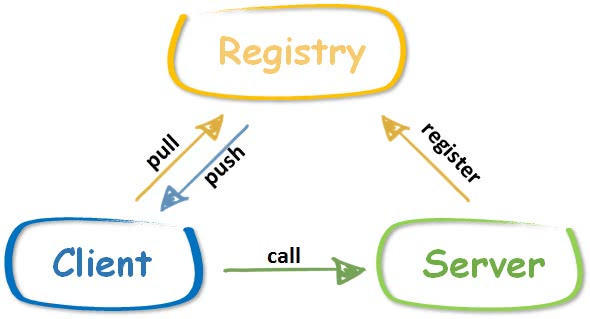

从零实现 Go 语言官方的标准库 net/rpc，并在此基础上，新增了协议交换（protocol exchange）、注册中心（registry）、服务发现（service discovery）、负载均衡（load balance）、超时处理（timeout processing）等特性。

## 运行过程

服务端从接收到请求到回复存在以下几个步骤：

- 第一步，根据入参类型，将请求的 body 反序列化；
- 第二步，调用 service.call，完成方法调用；
- 第三步，将 reply 序列化为字节流，构造响应报文，返回。


## 支持特性

### 协议转换

Web 开发中，我们经常使用 HTTP 协议中的 HEAD、GET、POST 等方式发送请求，等待响应。但 RPC 的消息格式与标准的 HTTP 协议并不兼容，在这种情况下，就需要一个协议的转换过程。HTTP 协议的 CONNECT 方法恰好提供了这个能力，CONNECT 一般用于代理服务。

为支持 HTTP 协议，RPC 服务端需要将 HTTP 协议转换为 RPC 协议，客户端需要新增通过 HTTP CONNECT 请求创建连接的逻辑。

#### 服务端支持 HTTP 协议

通信过程是这样的：

1. 客户端向 RPC 服务器发送 CONNECT 请求；

   ```go
   CONNECT 10.0.0.1:9999/_zrpc_ HTTP/1.0
   ```

2. RPC 服务器返回 HTTP 200 状态码，客户端检查返回状态码即可成功建立连接；

   ```go
   HTTP/1.0 200 Connected to ZRPC
   ```

   通过 HTTP CONNECT 请求建立连接之后，后续的通信过程就交给 NewClient 了。

3. 客户端使用创建好的连接发送 RPC 报文，先发送 Option，再发送 N 个请求报文，服务端处理 RPC 请求并响应。

支持 HTTP 协议的好处在于，RPC 服务仅仅使用了监听端口的 `/_zrpc` 路径，在其他路径上我们可以提供诸如日志、统计等更为丰富的功能。

#### 客户端支持 HTTP 协议

服务端已经能够接受 CONNECT 请求，并返回了 200 状态码 HTTP/1.0 200 Connected to ZRPC，客户端要做的，发起 CONNECT 请求，检查返回状态码即可成功建立连接。

通过 HTTP CONNECT 请求建立连接之后，后续的通信过程就交给新建的 NewClient 去处理了。


### 负载均衡

向用户暴露一个支持负载均衡的客户端 XClient：

```go
type XClient struct {
	d       Discovery
	mode    SelectMode
	opt     *Option
	mu      sync.Mutex // protect following
	clients map[string]*Client
}
```

Discovery 定义了服务发现接口，SelectMode 表示负载均衡模式：

```go
type Discovery interface {
	Refresh() error                      //从注册中心更新服务列表
	Update(servers []string) error       //手动更新服务列表
	Get(mode SelectMode) (string, error) //根据负载均衡策略，选择一个服务实例
	GetAll() ([]string, error)           //返回所有的服务实例
}
```

再实现一个不需要注册中心，服务列表由手工维护的服务发现的结构体，其实现了 Discovery 接口：

```go
type MultiServersDiscovery struct {
	r       *rand.Rand   // 生成一个随机数
	mu      sync.RWMutex 
	servers []string     
	index   int          // 记录 Robin 算法选中的位置
}
```

根据负载均衡策略选择服务实例：

```go
func (d *MultiServersDiscovery) Get(mode SelectMode) (string, error) {
	d.mu.Lock()
	defer d.mu.Unlock()
	n := len(d.servers)
	if n == 0 {
		return "", errors.New("rpc discovery: no available servers")
	}
	switch mode {
	case RandomSelect:
		return d.servers[d.r.Intn(n)], nil
	case RoundRobinSelect:
		s := d.servers[d.index%n] 
		d.index = (d.index + 1) % n
		return s, nil
	default:
		return "", errors.New("rpc discovery: not supported select mode")
	}
}
```


### 注册中心



注册中心的位置如上图所示。注册中心的好处在于，客户端和服务端都只需要感知注册中心的存在，而无需感知对方的存在。更具体一些：

- 服务端启动后，向注册中心发送注册消息，注册中心得知该服务已经启动，处于可用状态。一般来说，服务端还需要定期向注册中心发送心跳，证明自己还活着。
- 客户端向注册中心询问，当前哪些服务是可用的，注册中心将可用的服务列表返回客户端。
- 客户端根据注册中心得到的服务列表，选择其中一个发起调用。

如果没有注册中心，客户端需要硬编码服务端的地址，而且没有机制保证服务端是否处于可用状态。当然注册中心的功能还有很多，比如配置的动态同步、通知机制等。

主流的注册中心 etcd、zookeeper 等功能强大，与这类注册中心的对接代码量是比较大的，需要实现的接口很多。所以我们选择自己实现一个轻量化的注册中心。

首先定义 ZRegistry 结构体，默认超时时间设置为 5 min，也就是说，任何注册的服务超过 5 min，即视为不可用状态。

```go
type ZRegistry struct {
	timeout time.Duration           // 服务过期时间
	mu      sync.Mutex              // 保证 servers 读写安全
	servers map[string]*ServerItem  // 服务列表
}
```

然后，为 ZRegistry 实现添加服务实例和返回服务列表的方法。

- putServer：添加服务实例，如果服务已经存在，则更新 start；
- aliveServers：返回可用的服务列表，如果存在超时的服务，则删除。

为了实现上的简单，ZRegistry 采用 HTTP 协议提供服务，且所有的有用信息都承载在 HTTP Header 中。

- Get：返回所有可用的服务列表，通过自定义字段 X-Zrpc-Servers 承载；
- Post：添加服务实例或发送心跳，通过自定义字段 X-Zrpc-Server 承载。

另外，提供 Heartbeat 方法，便于服务启动时定时向注册中心发送心跳，默认周期比注册中心设置的过期时间少 1 min。


### 服务发现

本项目的服务发现采用客户端模式，即逻辑处理和负载均衡均在客户端中实现。实现服务发现的主要结构体：

```go
type ZRegistryDiscovery struct {
	*MultiServersDiscovery
	registry   string         // 注册中心的地址
	timeout    time.Duration  // 服务列表的过期时间
	lastUpdate time.Time      // 最后从注册中心更新服务列表的时间
}
```

ZRegistryDiscovery 嵌套了 MultiServersDiscovery，很多能力可以复用。

实现 Update 和 Refresh 方法，前者主动更新服务列表，后者超时重新（从注册中心）获服务列表。

Get 和 GetAll 与 MultiServersDiscovery 相似，唯一的不同在于，ZRegistryDiscovery 需要先调用 Refresh 确保服务列表没有过期。


### 超时处理

纵观整个远程调用的过程，需要客户端处理超时的地方有：

- 与服务端建立连接，导致的超时；
- 发送请求到服务端，写报文导致的超时；
- 等待服务端处理时，等待处理导致的超时（比如服务端已挂死，迟迟不响应）；
- 从服务端接收响应时，读报文导致的超时。

需要服务端处理超时的地方有：

- 读取客户端请求报文时，读报文导致的超时；
- 发送响应报文时，写报文导致的超时；
- 调用映射服务的方法时，处理报文导致的超时。

zRPC 在 3 个地方添加了超时处理机制。分别是：

1）客户端创建连接时;

2）客户端 Client.Call() 整个过程导致的超时（包含发送报文，等待处理，接收报文所有阶段）;

3）服务端处理报文，即 Server.handleRequest 超时。

#### 创建连接超时

实现了一个超时处理的外壳 `dialTimeout`，这个壳将 NewClient 作为入参，在 2 个地方添加了超时处理的机制：

- 将 `net.Dial` 替换为 `net.DialTimeout`，如果连接创建超时，将返回错误；
- 使用子协程执行 NewClient，执行完成后则通过通道 ch 发送结果。通过 select 监听时，如果 `time.After()` 通道先接收到消息，则说明 NewClient 执行超时，返回错误。

#### Client.Call 超时

Client.Call 的超时处理机制，使用 context 包实现，控制权交给用户，控制更为灵活。

用户可以使用 `context.WithTimeout` 创建具备超时检测能力的 context 对象来控制。使用 select 同时监听 ctx 和 call，以达到限时的效果。

#### 服务端处理超时

将整个过程拆分为 called 和 sent 两个阶段（用两个同名通道表示，select 进行监听），在 handleRequest 中只会发生如下两种情况：

- called 信道接收到消息，代表处理没有超时，继续执行 sendResponse；
- time.After() 先于 called 接收到消息，说明处理已经超时，called 和 sent 都将被阻塞。在 case <-time.After(timeout) 处调用 sendResponse。


## API

### 客户端

```go
// 关闭客户端连接
func (client *Client) Close() error
// 判断客户端是否可用
func (client *Client) IsAvailable() bool
// 创建 Client 实例
func NewClient(conn net.Conn, opt *Option) (*Client, error) 
// 客户端暴露给用户的 RPC 服务调用接口（异步），返回 call 实例
func (client *Client) Go(serviceMethod string, args, reply interface{}, done chan *Call) *Call
// 调用 client.Go，并等待其完成
func (client *Client) Call(ctx context.Context, serviceMethod string, args, reply interface{}) error 
// 连接到一个位于指定网络地址的 RPC 服务器
func Dial(network, address string, opts ...*Option) (*Client, error)
// 通过 HTTP 新建一个客户端实例作为传输协议
func NewHTTPClient(conn net.Conn, opt *Option) (*Client, error) 
// 连接到特定网络地址的一个 HTTP RPC 服务器
func DialHTTP(network, address string, opts ...*Option) (*Client, error) 
// 根据 rpcAddr 调用不同的函数来连接到一个 RPC 服务器
func XDial(rpcAddr string, opts ...*Option) (*Client, error)
```


### 服务端

```go
// 服务器新建函数
func NewServer() *Server 
// 在单一连接上运行服务。为连接提供服务期间，ServeConn 阻塞，直到客户端挂断。
func (server *Server) ServeConn(conn io.ReadWriteCloser) 
// 监听端接收连接，并为每个传入连接的请求提供服务
func (server *Server) Accept(lis net.Listener)
// 直接供外部调用的 API
func Accept(lis net.Listener) 
// 在服务端中发布新方法
func (server *Server) Register(rcvr interface{}) error 
// 在 DefaultServer 中发布接收方的方法。
func Register(rcvr interface{}) error 
// 实现了一个 http.Handler，以回应 RPC 请求
func (server *Server) ServeHTTP(w http.ResponseWriter, req *http.Request)
// 默认服务器注册 HTTP 处理器
func HandleHTTP() 
```


 ## 常见问题

### 为什么用 JSON 而非 Protocol Buffer？

首先，系统内传输的数据字段几乎都是字符串，占到决定性因素的因素可能是字符串拷贝的速度，而不是解析的速度。

其次，protobuf 的消息结构可读性不高，序列化后的字节序列为二进制序列不能简单的分析有效性。

最后，Json 可以任何语言都支持，但是 protobuf 需要下载安装专门的编译器和解析库。